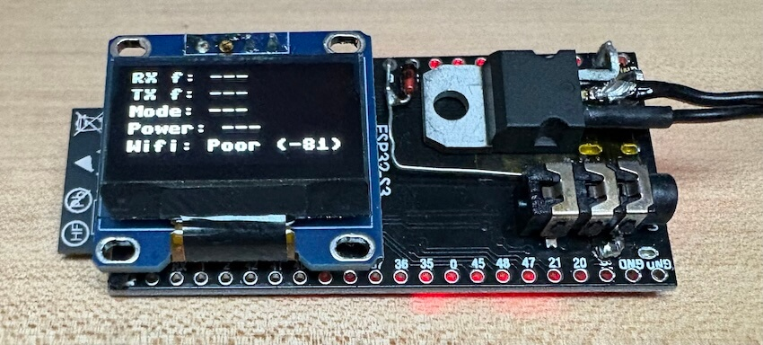
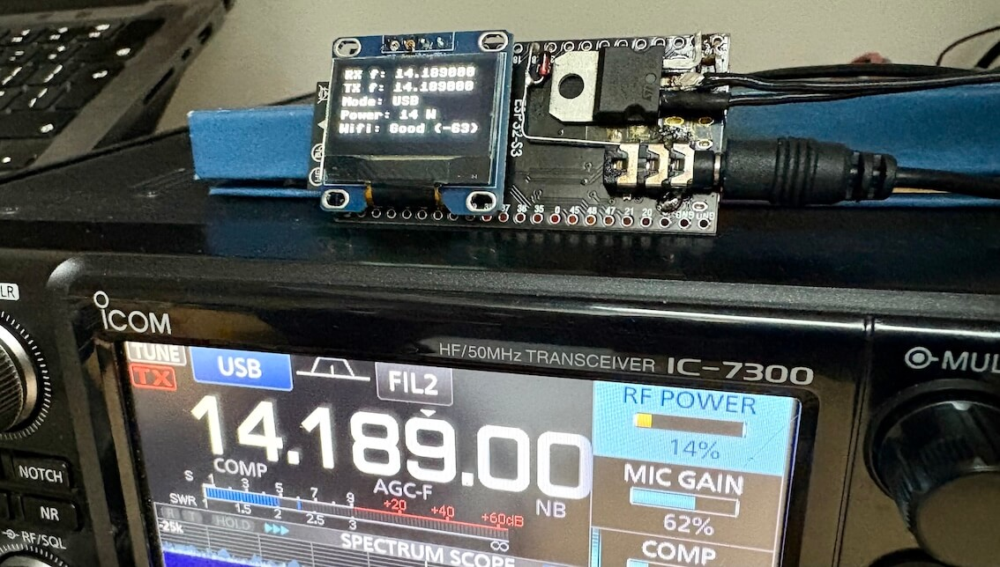

# Wavelog Radio Hardware Interface
Are you **lazy typing frequency** and mode each time you are logging 
a QSO using fantastic web-based [Wavelog](https://www.wavelog.org/) 
logger? And you also don't want to connect your radio to the regular 
computer and **fiddle with all the CAT software**, that needs to be running
each time you turn on the radio?

If the answer is yes, this little, standalone, ESP32-based device got you covered!

The device currently supports radios that are connected via 
**UART-based CAT** control port (Serial COM port). 

Radios that can be controlled
only through Bluetooth, Wi-fi, Ethernet or USB (This is especially 
the case of recently released radios) are not supported.

### Features:
- Easy to build
- Standalone device, no PC connected to the radio is needed
- Supports radios that has **UART-based CAT** control port and are supported by [Omnirig](https://dxatlas.com/OmniRig/)
- Automatically reports current frequency (both TX and RX) and mode to Wavelog
- If the radio driver file supports it, it can also report the rig RF power setting
- Exposes XML-RPC server for use with [Cloudlog Offline](https://github.com/myzinsky/cloudLogOffline) app
- Exposes API server that can be used to set frequency via HTTP call
- With the help of websockets proxy server, the radio can QSY to the frequency of Wavelog's DX Cluster spot on click (if the radio driver file supports it)
- Automatically reconnects to wi-fi in case connection is lost

## Supported radios
In theory, all radios that has UART-based CAT control port 
and are supported by [Omnirig](https://dxatlas.com/OmniRig/) should work.
This is because this device uses radio commands stored in omnirig ini 
driver files to read & control the radio. This makes this device 
vendor-and-model-independent as long as the radio has UART-based CAT 
control port and you use the correct UART voltage level-shifter for 
connecting this device to the radio (if applicable).

### Tested radios
Those are the radios known to be 100% working with the device, because
somebody has tested them already. If you tested the your radio and it 
is missing in this list, raise the issue and we will add it here.

- Icom IC-7300

### How to build the HW
For instructions how to build the device, see the dedicated [Wiki page](https://github.com/filipmelik/wavelog-trx-interface/wiki/Hardware).

### How to install firmware to the device
For instructions where to get and how to flash the firmware, see the dedicated [Wiki page](https://github.com/filipmelik/wavelog-trx-interface/wiki/Firmware-How%E2%80%90To).

### Possible future plans
- It would be cool to have custom hardware board :)

